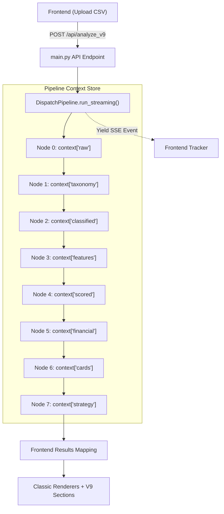

# ReviewInsightEngine — Dispatch V9 Architecture

## Overview
Dispatch V9 is the latest iteration of the ReviewInsightEngine. It transitions the application from a single, monolithic LLM prompt to an 8-node deterministic pipeline with automatic LLM multi-provider fallback and Server-Sent Events (SSE) streaming.

This document serves as a developer guide to understanding the V9 architecture, its core components, and how data flows through the system.

## Core Components

### 1. `LLMOrchestrator` (`core/llm_orchestrator.py`)
The orchestrator is responsible for routing all LLM requests to the best available model. It abstracts away provider-specific SDKs (Google, OpenAI, Anthropic, Groq) and provides silent fallback capabilities.

- **`ModelSelector`**: Reads API keys from the `.env` file and maps available models to specific **Task Profiles** (`classification`, `scoring`, `financial_model`, etc.). It ranks models based on their strengths, context windows, cost tiers, and base priority scores.
- **Silent Fallback**: If a model request fails (e.g., due to a 429 Rate Limit or a 404 Model Not Found), the orchestrator catches the exception and automatically tries the next best model in the queue.

### 2. `DispatchPipeline` (`core/pipeline_runner.py`)
The core execution engine for V9. It processes a raw CSV dataset through 8 sequential nodes, maintaining a central `context` dictionary.

- **Streaming Architecture**: Uses Python `AsyncGenerator` to yield events after each node completes. This allows the frontend to display a real-time progress tracker.
- **The Context Store**: A dictionary that accumulates data as it passes through the nodes (`raw`, `taxonomy`, `classified`, `features`, `scored`, `financial`, `cards`, `strategy`).
- **Nodes**:
  - `Node 0 (Validation)`: Ensures data quality and validates business logic inputs.
  - `Node 1 (Taxonomy)`: Identifies the best categorization strategy.
  - `Node 2 (Classification)`: Categorizes raw reviews.
  - `Node 3 (Extraction)`: Pulls specific feature requests and pain points.
  - `Node 4 (Scoring)`: Applies the 5-Axis scoring formula.
  - `Node 5 (Financial)`: Calculates Revenue at Risk and Opportunity size.
  - `Node 6 (Action Cards)`: Generates actionable engineering cards.
  - `Node 7 (Strategy)`: Synthesizes high-level strategic steps and a phased timeline.

### 3. API Integration (`main.py`)
- **Endpoint**: `POST /api/analyze_v9`
- **Output**: Returns a `StreamingResponse` using the `text/event-stream` media type.
- **Inputs**: Requires `csv_text` and accepts optional `business_inputs` (`total_users`, `monthly_arpu`, `sprint_cost`).

### 4. Frontend Integration (`static/index.html`)
- **Progress Tracker**: Listens to the `/api/analyze_v9` SSE stream. Updates the 8-node UI tracker (`○` -> `●` -> `✓`) in real-time.
- **Data Mapping**: The `mapV9ToClassic()` function bridges the structural gap between the 8-node `context` store and the classic dashboard renderers, ensuring seamless integration with existing high-end UI components (Executive Summary, Sentiment Breakdowns, etc.).
- **V9-Specific Renderers**: `renderV9StrategicSection()` and `renderV9ActionPlan()` handle the unique outputs of Node 7.

## Data Flow Diagram

## Adding a New LLM Provider
To add a new provider to the `LLMOrchestrator`:
1. Add the SDK to `requirements.txt`.
2. Register the models in `MODEL_REGISTRY` in `llm_orchestrator.py` with the appropriate `env_key` and characteristics.
3. Add the initialisation logic in `LLMOrchestrator._init_clients()`.
4. Create a dispatch branch in `_call_model()` that points to a new `_call_<provider>()` function.
